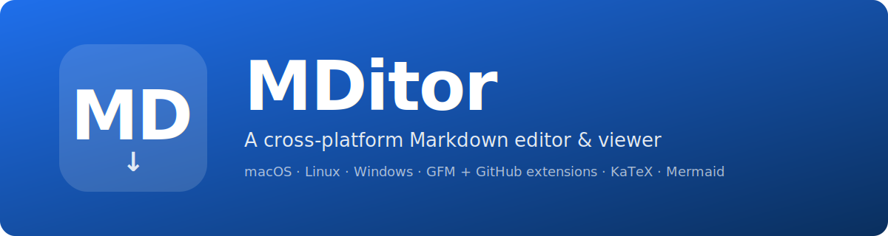

<p align="center">
  
</p>

# MDitor

<p>
  
  
  
  
  
</p>

A cross-platform desktop **markdown viewer & editor** with a side-by-side or tabbed live preview, an optional table-of-contents (TOC) panel, OS-native spell checking, Word-like formatting shortcuts, GitHub Flavored Markdown, and code syntax highlighting.

Runs on **macOS (Apple Silicon)**, **Windows (x64)**, and **Linux (x64)**.

## Features

- **Two views, one shortcut.** Edit and preview side-by-side or as switchable tabs (`Cmd/Ctrl+\`).
- **TOC panel.** Optional left-side table-of-contents built from `#` headings — click to jump in both editor and preview (`Cmd/Ctrl+Shift+T`).
- **Native spell-check.** Uses your OS's dictionary (macOS Cocoa, Windows Spell Check API, Hunspell on Linux). Right-click misspelled words for suggestions and to add to your personal dictionary.
- **Word-like shortcuts.** `Cmd/Ctrl+B` wraps in `**bold**`, `Cmd/Ctrl+I` wraps in `*italic*`, `Cmd/Ctrl+U` wraps in `<u>underline</u>`. With no selection, the markers are inserted with the cursor placed between them.
- **Smart lists.** Press Enter on a `-`, `*`, `+`, or `1.` line to continue the list. Double-Enter exits the list.
- **Always on:** GFM (tables, task lists, strikethrough `~~double~~`, autolinks), inline & display math (`$x^2$` / `$$ … $$`, via KaTeX), and Mermaid diagrams in ` ```mermaid ` fenced blocks.
- **GH toggle for GitHub-only extensions** (`Cmd/Ctrl+Shift+G`): alerts (`> [!NOTE]`/`[!TIP]`/`[!IMPORTANT]`/`[!WARNING]`/`[!CAUTION]`), footnotes (`[^1]`), single-tilde strikethrough (`~text~`), and emoji shortcodes (`:rocket:`).
- **Syntax-highlighted code blocks.** Powered by [highlight.js](https://highlightjs.org/) with the GitHub theme.
- **`.md` file association.** MDitor registers as a recommended app for `.md` and `.markdown` files on all three OSes.
- **Single window, single instance.** Opening a second `.md` from the OS routes into the existing window.

## Install

Pre-built binaries are attached to each [GitHub Release](../../releases). Pick the right one for your OS:

| OS | Architecture | File |
|----|--------------|------|
| macOS | Apple Silicon | `MDitor-<version>-arm64.dmg` |
| Windows | x64 | `MDitor Setup <version>.exe` |
| Linux | x64 | `MDitor-<version>.AppImage` (portable), `mditor_<version>_amd64.deb`, `mditor-<version>.x86_64.rpm` |

### macOS — first launch

The macOS DMG ships **unsigned** in the current release line. Gatekeeper will refuse to open it on the first launch. To bypass:

```sh
xattr -cr /Applications/MDitor.app
```

(Or right-click the app in Finder → Open → Open.)

### Linux

- **AppImage:** `chmod +x MDitor-<version>.AppImage && ./MDitor-<version>.AppImage`
- **deb:** `sudo apt install ./mditor_<version>_amd64.deb`
- **rpm:** `sudo dnf install ./mditor-<version>.x86_64.rpm`

### Windows

Run the NSIS installer (`MDitor Setup <version>.exe`). The installer registers the app for `.md` files and creates Start Menu and desktop shortcuts.

## Default file handler

After install, right-click any `.md` file → **Open With** → MDitor. Set as default to make double-clicking `.md` files launch MDitor.

## Keyboard shortcuts

| Action | Shortcut |
|--------|----------|
| New | `Cmd/Ctrl+N` |
| Open | `Cmd/Ctrl+O` |
| Save | `Cmd/Ctrl+S` |
| Save As | `Cmd/Ctrl+Shift+S` |
| Bold | `Cmd/Ctrl+B` |
| Italic | `Cmd/Ctrl+I` |
| Underline | `Cmd/Ctrl+U` |
| Toggle Split / Tabs | `Cmd/Ctrl+\` |
| Toggle TOC Panel | `Cmd/Ctrl+Shift+T` |
| Toggle GitHub Extensions (GH) | `Cmd/Ctrl+Shift+G` |

## Development

Requires **Node.js 20+** and npm. On first checkout:

```sh
npm install
npm run icons     # generate build/icon.{icns,ico,png} from assets/*.svg (macOS)
npm run dev       # starts Vite + Electron
```

`npm run dev` launches the Vite dev server on port 5173 and an Electron window pointed at it. The app opens a sample document so you can verify the editor, preview, ToC, and spell-check immediately.

### Available scripts

| Script | Purpose |
|--------|---------|
| `npm run dev` | Vite dev server + Electron in watch mode |
| `npm run build` | Compile main, preload, and renderer to `dist-main/` and `dist-renderer/` |
| `npm run pack` | `electron-builder --dir` (unpacked app, no installer) |
| `npm run dist` | `electron-builder` for the host OS |
| `npm run dist:mac` | `electron-builder --mac --arm64` |
| `npm run dist:win` | `electron-builder --win --x64` |
| `npm run dist:linux` | `electron-builder --linux --x64` |
| `npm run icons` | Regenerate icon files from `assets/icon.svg` and `assets/file-icon.svg` (`iconutil` on macOS only for `.icns`) |
| `npm run check-version` | `node scripts/check-version.mjs <version>` — used by CI |
| `npm run typecheck` | TypeScript no-emit check on main+preload+renderer |

### Project layout

```
src/
  main/         # Electron main process (window, menu, IPC, spellcheck context menu)
  preload/      # contextBridge surface exposed as window.api
  shared/       # IPC channel names + payload types
  renderer/     # React app (CodeMirror editor, marked preview, ToC)
build/          # icon files + macOS entitlements
assets/         # source SVGs for the icons
scripts/        # check-version + icon generator
.github/workflows/release.yml
```

The renderer is sandboxed with `contextIsolation: true` and `sandbox: true`. All file I/O goes through the preload bridge — the renderer never touches `fs` directly.

## Releasing

1. Bump the `"version"` field in `package.json` (e.g. `0.1.0` → `0.2.0`) and commit.
2. Push to `main`.
3. Open the GitHub Actions tab → **Release** workflow → **Run workflow**.
4. Enter the same version in the `version` input. The workflow:
   - Validates the input matches `package.json` (fails fast on mismatch).
   - Builds the macOS DMG, Windows NSIS installer, and Linux AppImage/deb/rpm in parallel.
   - Uploads each artifact to **JFrog Fly** under `mditor/<version>/<filename>`.
   - Creates a **draft** GitHub release with all artifacts attached, ready for review.

The draft release is intentionally not published automatically — review the artifacts, edit the notes, then publish from the GitHub UI when ready.

## License

[MIT](LICENSE)
