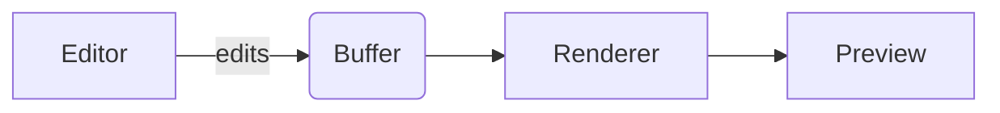

# Welcome to MDitor

A cross-platform **markdown** editor with a *live preview*. GFM, math, and mermaid are always on; toggle **GH Ext** for GitHub-only extensions.

## Always on

GFM, math (KaTeX), and mermaid render no matter what.

| Feature        | Example                          |
|----------------|----------------------------------|
| Tables         | this one                         |
| Task lists     | see below                        |
| Strikethrough  | ~~double tilde~~                 |
| Autolinks      | https://github.com               |

- [x] Tables, task lists, strikethrough, autolinks
- [ ] Inline math: $E = mc^2$

### Math (KaTeX)

$$
\int_{-\infty}^{\infty} e^{-x^2}\,dx = \sqrt{\pi}
$$

### Mermaid diagrams



## GH Ext — GitHub-only extensions (toggle to see them turn on/off)

> [!NOTE]
> Alerts render as colored callouts.
>
> With GH Ext off, this becomes raw `> [!NOTE]` text.

> [!TIP]
> You use [!NOTE], [!TIP], [!IMPORTANT], [!WARNING] and [!CAUTION]


Single-tilde strikethrough: ~one tilde~. Footnote ref: see [^1].

### Emoji shortcodes

`:rocket:` → :rocket:, `:tada:` → :tada:, `:coffee:` → :coffee:

## Code highlighting

```ts
function greet(name: string): string {
  return `hello, ${name}`;
}
```

## Find your way around

- **Keyboard shortcuts:** **Help → Keyboard Shortcuts** (or click the **?** in the toolbar)
- **Find / Replace:** `Cmd/Ctrl+F` and `Cmd/Ctrl+Alt+F` inside the editor
- **Reload the window:** `Cmd/Ctrl+R` (also under View → Reload)

[^1]: Footnotes appear at the bottom of the rendered output when `GH Ext` is on.
